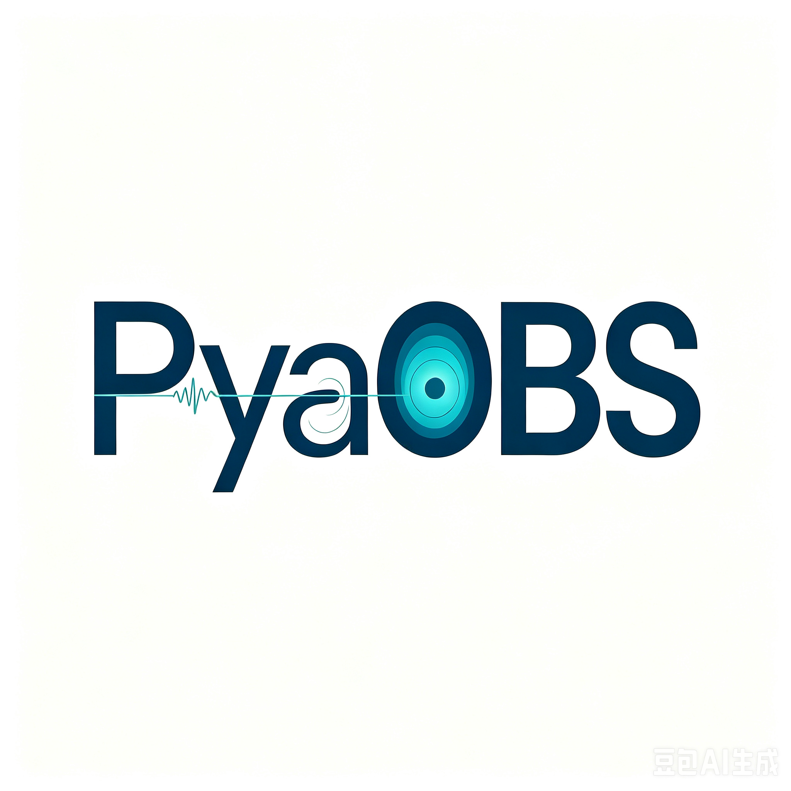

# pyAOBS

<p align="center">
  
</p>

[](https://opensource.org/licenses/MIT)
[](https://www.python.org/downloads/)

A Python toolkit for active-source ocean-bottom seismology: Zelt velocity models, workbench GUIs (imodel / zplot / iphase), and KKHS02 petrology workflows.

**Current release candidate:** `3.0.0rc1` — see [CHANGELOG.md](CHANGELOG.md).

## Features

- Read and write ZELT format velocity models (`v.in`)
- Workbench shell for imodel (Qt), zplot, iphase, tomography, LIP petrology
- KKHS02-style mantle melting / H–Vp / fractional-crystallization (ΔVp) tools
- Visualization with Matplotlib / optional PyGMT
- Processors for SU and related OBS workflows

## Installation

### From source (recommended for 3.0.0rc1)
```bash
git clone https://github.com/go223-pyAOBS/pyAOBS.git
cd pyAOBS
git checkout v3.0.0rc2   # after the tag is published
pip install -e ".[gui-qt]"
# optional petrology extras:
# pip install -e ".[gui-qt,petrology]"
```

### From a Git tag (recommended for 3.0.0rc1)
Use Direct URL syntax (modern pip; do **not** use `#egg=...[extra]`):
```bash
pip install "pyAOBS[gui-qt] @ git+https://github.com/go223-pyAOBS/pyAOBS.git@v3.0.0rc2"
```
Core package only (no Qt extras):
```bash
pip install "pyAOBS @ git+https://github.com/go223-pyAOBS/pyAOBS.git@v3.0.0rc2"
```

### From PyPI
Stable PyPI wheels may lag behind GitHub tags; prefer the Git tag install above for RC builds:
```bash
pip install "pyAOBS[gui-qt]"
```

## Dependencies

### Required Dependencies

核心 GUI（imodel / zplot / workbench）与岩性分类所需：

- numpy >= 1.24, < 2.1（支持 1.24–1.26 与 2.0.x；zplot Fortran 内核在 NumPy 升级后会自动重编）
- xarray >= 2023.1.0
- scipy >= 1.13.0
- matplotlib >= 3.8.0
- pandas >= 2.0.0
- scikit-learn >= 1.5.0（imodel 岩性分类）
- seaborn >= 0.13.0（岩石识别 / isrock）
- openpyxl >= 3.0.0

### Optional Dependencies

- PySide6 >= 6.4.0（imodel Qt 界面，`pip install pyAOBS[gui-qt]`）
- pygmt >= 0.5.0 (for GMT-based visualization)
- pyproj >= 3.0.0 (for coordinate projection)
- obspy >= 1.2.0 (for seismic data processing)
- numba >= 0.59（zplot 叠加等可选加速；需与当前 NumPy 小版本兼容）

Install with optional dependencies:

```bash
pip install pyAOBS[gui-qt]  # imodel Qt + workbench 启动 imodel
pip install pyAOBS[full]    # Install with all optional dependencies
pip install pyAOBS[gmt]     # Install with GMT support only
```

## Usage

```python
from pyAOBS.model_building import ZeltVelocityModel2d, EnhancedZeltModel

# Basic usage
model = ZeltVelocityModel2d("velocity.in")
velocity = model.at(100.0, 1.5)  # Get velocity at point (100.0, 1.5)

# Enhanced features
enhanced_model = EnhancedZeltModel("velocity.in")
avg_velocities = enhanced_model.compute_average_velocities()

# Visualization
from pyAOBS.visualization import ZeltModelVisualizer

visualizer = ZeltModelVisualizer(model)
visualizer.plot_zeltmodel(
    output_file="velocity_model.png",
    title="Velocity Model",
    colorbar_label="Velocity (km/s)"
)
```

## Documentation

For detailed documentation and examples, please visit our [documentation page](https://go223-pyAOBS.github.io/pyAOBS).

### Workbench Guide

For the unified project GUI workflow (project management, run history, batch rerun, exports), see:

- [pyAOBS/workbench/README.md](pyAOBS/workbench/README.md)

## Contributing

We welcome contributions! Please feel free to submit a Pull Request.

## License

This project is licensed under the MIT License - see the [LICENSE](LICENSE) file for details.

## Author

Haibo Huang (go223@scsio.ac.cn)

## Citation

If you use pyAOBS in your research, please cite:

```bibtex
@software{pyAOBS2024,
  author = {Haibo Huang},
  title = {pyAOBS: A Python Package for Seismic Data Processing and Visualization},
  year = {2024},
  publisher = {GitHub},
  url = {https://github.com/go223-pyAOBS/pyAOBS}
}
``` 